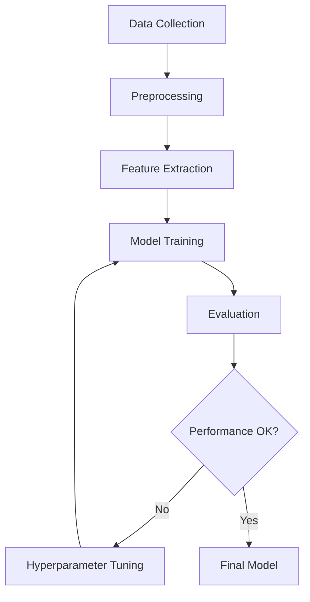
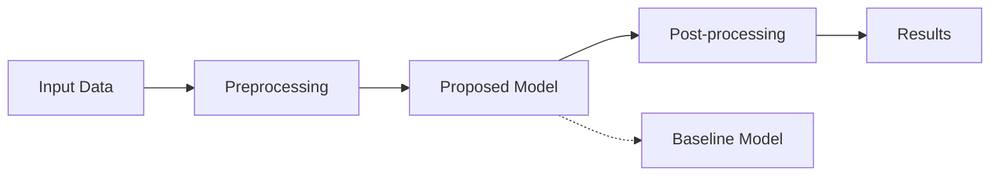

# Research Paper Template

Use this template for academic papers, research articles, scientific publications, and formal research documentation.

## Structure

```markdown
---
title: <paper title>
authors: [<author1>, <author2>, <author3>]
date: <publication date>
source: <original URL or DOI>
publication: <journal/conference name>
tags: [研究, <field>, <methodology>, <topic>]
type: research
created: <YYYY-MM-DD>
---

# <Paper Title>

> **Authors**: <Author list>
> **Publication**: <Journal/Conference>
> **Date**: <Publication Date>
> **Source**: [Paper Link](<URL>)
> **DOI**: <DOI if available>

## Abstract

<Copy or summarize the paper's abstract>

## Research Question / Problem Statement

<What problem is this research addressing? What gap in knowledge does it fill?>

## Key Contributions

1. <Main contribution 1>
2. <Main contribution 2>
3. <Main contribution 3>

## Methodology

### Approach

<Overall research approach - experimental, theoretical, empirical, etc.>

### Methods

<Specific methods, techniques, or algorithms used>

### Data

- **Dataset**: <Name and description of datasets used>
- **Size**: <Sample size, data volume>
- **Source**: <Where data came from>
- **Preprocessing**: <Any data preparation steps>

### Experimental Setup

<Description of how experiments were conducted>

```mermaid
<If applicable, diagram showing experimental workflow or system architecture>
```

## Results

### Main Findings

1. **<Finding 1>**: <Description and significance>
2. **<Finding 2>**: <Description and significance>
3. **<Finding 3>**: <Description and significance>

### Performance Metrics

<If applicable, include tables or key performance numbers>

| Metric | Baseline | Proposed Method | Improvement |
|--------|----------|----------------|-------------|
| <metric 1> | <value> | <value> | <change> |
| <metric 2> | <value> | <value> | <change> |

### Key Observations

- <Important observation from results>
- <Important observation from results>
- <Important observation from results>

## Analysis & Discussion

<Interpretation of results, implications, comparison with related work>

### Strengths

- <What this research does well>
- <Advantages over previous approaches>

### Limitations

- <Acknowledged limitations in the study>
- <Constraints or assumptions made>

## Conclusions

<Main conclusions drawn from the research>

## Future Work

<Directions for future research suggested by the authors>

## Related Work

### Prior Research

- **<Paper/Study 1>**: <How it relates to this work>
- **<Paper/Study 2>**: <How it relates to this work>

### Comparison

<How this work compares to or builds upon related research>

## Key Equations / Formulas

<If the paper has important mathematical formulations>

<equation or formula>

Where:
- <variable>: <definition>
- <variable>: <definition>

## Practical Applications

<How this research can be applied in practice>

1. <Application area 1>
2. <Application area 2>
3. <Application area 3>

## Critical Assessment

### Strengths of This Research

- <What makes this research valuable>
- <Methodological strengths>

### Questions / Concerns

- <Potential concerns or questions about the methodology>
- <Areas that could be explored further>

## References

<Key papers cited that are worth following up on>

1. <Important reference 1>
2. <Important reference 2>
3. <Important reference 3>

## Personal Notes

<Your own thoughts, connections to other work, ideas for application>

---

**Read on**: <Date saved in YYYY-MM-DD format>
```

## Guidelines

1. **Abstract**: Include the full abstract verbatim when possible
2. **Methodology**: Be specific about methods - other researchers should understand how to replicate
3. **Results**: Include quantitative results, tables, and key performance metrics
4. **Critical perspective**: Don't just summarize - analyze strengths and limitations
5. **Context**: Explain how this fits into the broader research landscape

## Methodology Diagrams

Use Mermaid to visualize:

**Research workflow**:


**System architecture**:


## What to Include

- Research motivation and problem statement
- Complete methodology details
- Quantitative results and metrics
- Limitations acknowledged by authors
- Comparison with baseline/prior work
- Mathematical formulations if central to the work
- Experimental setup and parameters
- Statistical significance of results
- Potential applications

## What to Omit

- Excessive background on well-known concepts
- Detailed proofs unless central to understanding
- Literature review unless directly relevant
- Standard experimental protocols (unless novel)
- Excessive citation details (keep key references only)

## Field-Specific Notes

**Machine Learning papers**:
- Include model architecture diagrams
- Report training details (epochs, learning rate, optimizer)
- Include ablation study results
- Note dataset splits (train/val/test)

**Systems papers**:
- Include system architecture
- Report performance benchmarks
- Describe implementation details
- Note scalability characteristics

**Theory papers**:
- Include key theorems and proofs
- Explain implications of theoretical results
- Note assumptions and constraints
- Discuss practical applicability