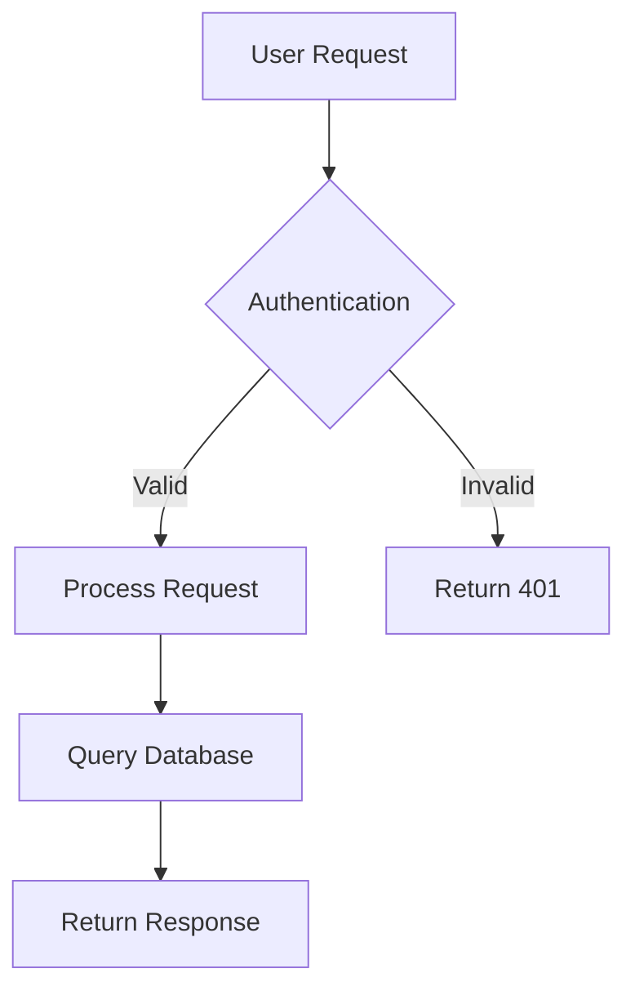
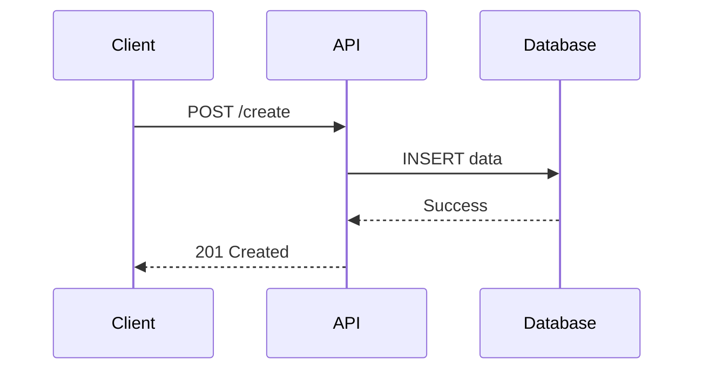
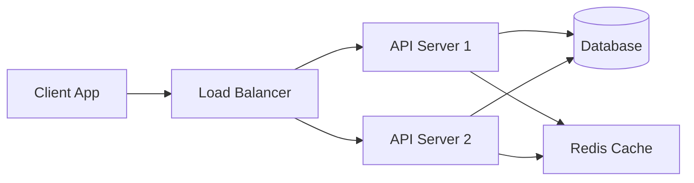

# Technical Content Template

Use this template for technical documentation, tutorials, API references, architecture guides, system design articles, and code-heavy content.

## Structure

```markdown
---
title: <article title>
author: <author name or "Unknown">
date: <publication date or fetch date>
source: <original URL>
tags: [技术, <language>, <framework>, <technology>]
type: technical
created: <YYYY-MM-DD>
---

# <Article Title>

> **Source**: [Original Article](<URL>)
> **Author**: <Author Name>
> **Date**: <Publication Date>
> **Tech Stack**: <Languages/frameworks mentioned>

## Overview

<2-3 paragraphs explaining what technology/concept this article covers, why it matters, and what problem it solves. Include context about when you'd use this.>

## Key Concepts

- **<Concept 1>**: <Definition and significance>
- **<Concept 2>**: <Definition and significance>
- **<Concept 3>**: <Definition and significance>

## Architecture / System Design

<If the article describes a system, architecture, or design pattern, include a Mermaid diagram here>

```mermaid
<diagram>
```

<Explanation of the architecture, components, and how they interact>

## Implementation Details

### <Component/Feature 1>

<Description of how this works>

```<language>
<relevant code snippet>
```

**Key points**:
- <Important implementation detail>
- <Important implementation detail>

### <Component/Feature 2>

<Description of how this works>

```<language>
<relevant code snippet>
```

**Key points**:
- <Important implementation detail>
- <Important implementation detail>

## Code Examples

### Example 1: <Use Case>

```<language>
<complete, runnable code example>
```

**Explanation**: <What this code does and why>

### Example 2: <Use Case>

```<language>
<complete, runnable code example>
```

**Explanation**: <What this code does and why>

## Best Practices

1. **<Practice 1>**: <Why this matters>
2. **<Practice 2>**: <Why this matters>
3. **<Practice 3>**: <Why this matters>

## Gotchas / Common Mistakes

- ⚠️ **<Mistake 1>**: <What goes wrong and how to avoid it>
- ⚠️ **<Mistake 2>**: <What goes wrong and how to avoid it>
- ⚠️ **<Mistake 3>**: <What goes wrong and how to avoid it>

## Performance Considerations

<If the article discusses performance, include relevant metrics, benchmarks, or optimization tips>

## When to Use

✅ **Use this when**:
- <Scenario 1>
- <Scenario 2>

❌ **Avoid this when**:
- <Scenario 1>
- <Scenario 2>

## References

- [Official Documentation](<link>)
- [Related Article](<link>)
- [GitHub Repository](<link>)

## Next Steps

1. <Action item or next thing to learn>
2. <Action item or next thing to learn>
3. <Action item or next thing to learn>

---

**Read on**: <Date saved in YYYY-MM-DD format>
```

## Guidelines

1. **Diagrams**: Use Mermaid for flowcharts, sequence diagrams, and architecture diagrams
   - `graph TD` for flowcharts
   - `sequenceDiagram` for interactions
   - `classDiagram` for object relationships
   - `graph LR` for horizontal flows

2. **Code snippets**: Include complete, runnable examples when possible
   - Add language identifier for syntax highlighting
   - Include comments explaining non-obvious parts
   - Show both basic and advanced usage

3. **Technical depth**: Don't oversimplify - developers need details
   - Include configuration options
   - Mention edge cases
   - Explain trade-offs

4. **Structure**: Organize by logical flow, not document structure
   - Start with overview/concepts
   - Then architecture/design
   - Then implementation details
   - End with practical application

## Mermaid Diagram Examples

**Flowchart**:


**Sequence Diagram**:


**Architecture**:


## What to Include

- System architecture and component relationships
- Complete code examples (not just fragments)
- Configuration and setup instructions
- Error handling patterns
- Performance characteristics
- Security considerations
- Testing strategies
- Deployment considerations

## What to Omit

- Marketing fluff about "revolutionary" or "cutting-edge"
- Excessive background on basic concepts (unless necessary)
- Incomplete code snippets that won't run
- Deprecated or outdated approaches (unless for historical context)